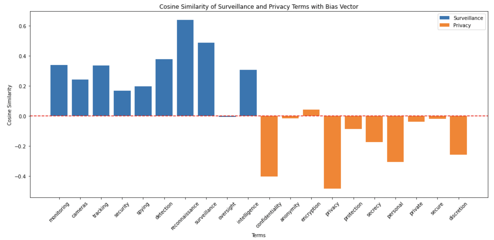
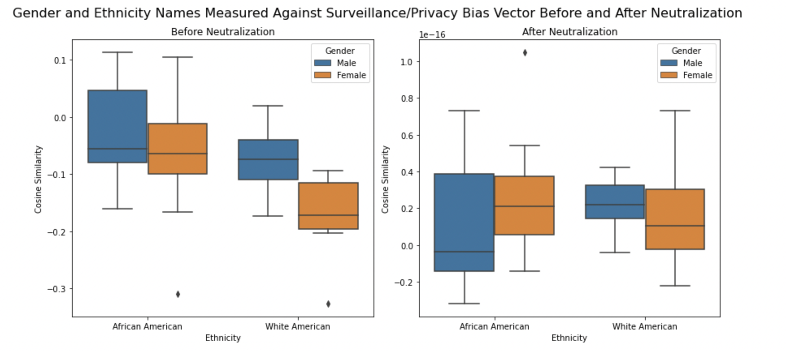
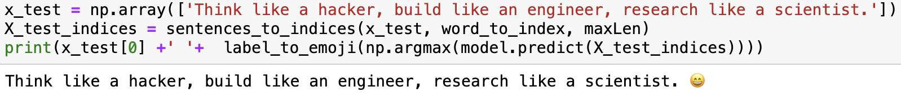

# Rex Coleman Machine Learning Cybersecurity Portfolio
A curated collection of machine learning projects demonstrating practical applications and advanced methodologies.

## Introduction
Welcome to my Machine Learning and Cybersecurity Portfolio. As a seasoned data scientist with extensive experience in cybersecurity, I aim to showcase my comprehensive skill set through a series of projects that blend advanced data science methodologies with robust cybersecurity principles. This portfolio highlights my strategy of intentionally building upon leading projects from Kaggle to accelerate my learning curve and develop a top 1% data science skill set. Each project is carefully selected and meticulously crafted to demonstrate my proficiency and dedication to the field.

## Table of Contents
1. [About Me](#1-about-me)
   - [1.1 Programming Languages](#11-programming-languages)
   - [1.2 Tools and Technologies](#12-tools-and-technologies)
   - [1.3 Data Handling and Analysis](#13-data-handling-and-analysis)
   - [1.4 Mathematics for Machine Learning](#14-mathematics-for-machine-learning)
   - [1.5 Machine Learning and Deep Learning](#15-machine-learning-and-deep-learning)
   - [1.6 Models](#16-models)
   - [1.7 Methodologies and Best Practices](#17-methodologies-and-best-practices)
2. [Projects Overview](#2-projects-overview)
   - [2.1 Cybersecurity Data](#21-cybersecurity-data)
     - [2.1.1 Microsoft Malware Prediction](#211-microsoft-malware-prediction)
   - [2.2 Deep Learning](#22-deep-learning)
     - [2.2.1 Neutralizing Surveillance / Privacy Bias](#221-neutralizing-surveillance--privacy-bias)
     - [2.2.2 Enhancing Phishing Detection With Neural Style Transfer](#222-enhancing-phishing-detection-with-neural-style-transfer)
     - [2.2.3 Image Segmentation with U-Net](#223-image-segmentation-with-u-net)
     - [2.2.4 Emojify!](#224-emojify)
   - [2.3 Data Science Frameworks](#23-data-science-frameworks)
     - [2.3.1 Generalized Data Science Framework - Titanic](#231-generalized-data-science-framework---titanic)
     - [2.3.2 Machine Learning Framework - Pima Indians](#232-machine-learning-framework---pima-indians)
   - [2.4 Data Preparation](#24-data-preparation)
     - [2.4.1 Feature Engineering Deep Dive - Pima Indians](#241-feature-engineering-deep-dive---pima-indians)
     - [2.4.2 Outliers Deep Dive - Pima Indians](#242-outliers-deep-dive---pima-indians)
   - [2.5 Model Specific](#25-model-specific)
     - [2.5.1 TensorFlow Decision Forest - Titanic](#251-tensorflow-decision-forest---titanic)
     - [2.5.2 K Nearest Neighbors - Pima Indians](#252-k-nearest-neighbors---pima-indians)
3. [Achievements and Recognitions](#3-achievements-and-recognitions)
4. [Learning And Development](#4-learning-and-development)
5. [Contact Information](#5-contact-information)

## 1) About Me
I am a data scientist with a strong background in cybersecurity. My career journey has been shaped by a passion for solving complex problems and a commitment to continuous learning. I am a candidate for a Masters of Science in Analytics from Georgia Tech, hold an MBA from Melbourne Business School in Australia, a Bachelor of Science in Biochemistry from the University of California Santa Cruz and have worked on various projects that demonstrate my skills in both data science and cybersecurity.

### 1.1) Programming Languages
- **Python**
- **SQL**

### 1.2) Tools and Technologies
- **Machine Learning and Deep Learning Frameworks:** TensorFlow, Scikit-Learn
- **Data Manipulation and Analysis:** Pandas, NumPy
- **Visualization:** Matplotlib, Seaborn
- **Development and Environment:** Anaconda, Jupyter Notebooks
- **Version Control and Collaboration:** Git, GitHub
- **Others:** SciPy, itertools, Graphviz, os, sys, IPython, random, time, Dask, tqdm, pickle

### 1.3) Data Handling and Analysis
- **Processes:** Data Mining, Data preprocessing, feature engineering, exploratory data analysis

### 1.4) Mathematics for Machine Learning
- **Linear Algebra:** Eigenvalues And Eigenvectors, Basis, Transformation Matrix
- **Multivariate Calculus:** Principal Component Analysis (PCA), Dimensionality Reduction, Multivariable Calculus, Vector Calculus, Linear Regression, Gradient Descent, Backpropagation, Mathematical Optimization
- **Probability & Statistics:** Statistical Analysis, Probability, Statistical Hypothesis Testing
  
### 1.5) Machine Learning and Deep Learning
- **Techniques:** Regression, classification, clustering, neural networks, ensembling, stacking, Logistic Regression
- **Sequence Models:** Transformers, Attention Models, Gated Recurrent Unit (GRU), Recurrent Neural Network, Natural Language Processing, Long Short Term Memory (LSTM)
- **Convolutional Neural Networks:** Facial Recognition System, Object Detection and Segmentation
- **Unsupervised Learning:** Anomaly Detection, Reinforcement Learning, Collaborative Filtering, Recommender Systems
- **Structuring Machine Learning Projects:** Neural Network Architecture, Decision-Making, Inductive Transfer, Multi-Task Learning, Hyperparameter Tuning, Regularization to Avoid Overfitting

### 1.6) Models
- **Trees:** DecisionTreeClassifier, ExtraTreeClassifier
- **Ensemble Methods:** XGBClassifier, AdaBoost, Bagging, ExtraTrees, GradientBoosting, RandomForest
- **Gaussian Processes:** GaussianProcessClassifier
- **Generalized Linear Models (GLM):** LogisticRegressionCV, PassiveAggressiveClassifier, RidgeClassifierCV, SGDClassifier, Perceptron
- **Naive Bayes:** BernoulliNB, GaussianNB
- **Nearest Neighbors:** KNeighborsClassifier
- **Support Vector Machines (SVM):** SVC, NuSVC, LinearSVC
- **Discriminant Analysis:** LinearDiscriminantAnalysis, QuadraticDiscriminantAnalysis

### 1.7) Methodologies and Best Practices
- **Project Management:** Version control with Git, comprehensive documentation, organized code structure
- **Data Science Workflow:** Data collection, preprocessing, modeling, evaluation, and deployment
- **Quality Assurance:** Cross-validation, hyperparameter tuning, rigorous model evaluation

## 2) Projects Overview
### 2.1) Cybersecurity Data
#### [2.1.1) Microsoft Malware Prediction](https://github.com/rexcoleman/Microsoft-Malware-Prediction)

**Why This Project Matters:**

This project showcases my ability to tackle real-world cybersecurity challenges using advanced data science techniques. It demonstrates my proficiency in managing large-scale data, implementing sophisticated algorithms, and delivering actionable insights that can enhance security measures.

**Project Highlights:**
- **Flagship Project:** This project represents the intersection of cybersecurity and data science, making it a cornerstone of my portfolio.
- **Production-Ready Design:** The project is cleanly organized and designed for a production environment, handling large and complex datasets effectively.
- **Advanced Techniques:** Utilizes LightGBM, a state-of-the-art gradient boosting framework that enhances model performance and efficiency.

### 2.2) Deep Learning
#### 2.2.1) Neutralizing Surveillance / Privacy Bias
**Why This Project Matters:**

This project demonstrates my understanding of word embeddings and their applications in natural language processing. It highlights my ability to uncover and mitigate cybersecurity biases in machine learning models, promoting fairness, accuracy and improved cybersecurity systems.

**Project Highlights:**
- **Word Embeddings:** Loads, measures similarity, and modifies pre-trained word embeddings to capture relationships between words.
- **Word Analogies:** Solves word analogy problems and explores the concept of gender bias in word embeddings.
- **Debiasing Techniques:** Implements algorithms to reduce gender bias in word embeddings, ensuring fairness in NLP applications.

#### [2.2.2) Enhancing Phishing Detection With Neural Style Transfer](https://github.com/rexcoleman/Enhancing_Phishing-Detection-With-Neural-Style-Transfer)
**Why This Project Matters:**

This project blends creativity with deep learning, demonstrating my ability to apply advanced neural network techniques to generate novel and artistic outputs. In the realm of cybersecurity, Neural Style Transfer can be used for advanced obfuscation techniques, phishing detection, and forensic analysis, among other applications. This highlights my proficiency in implementing complex algorithms and optimizing cost functions to solve real-world cybersecurity challenges.

**Project Highlights:**

- **Creative Application:** Combines the content of one image with the style of another to create unique artistic images. In cybersecurity, this technique can be adapted for obfuscation, camouflage detection, and steganography detection.
- **Advanced Deep Learning:** Implements Neural Style Transfer using TensorFlow and VGG-19, showcasing the use of pre-trained models for transfer learning. These models can be leveraged to enhance cybersecurity threat detection and analysis.
- **Optimization Techniques:** Focuses on optimizing cost functions to generate visually appealing images. Optimization skills are crucial for improving the performance of various cybersecurity models.

#### 2.2.3) Image Segmentation with U-Net
**Why This Project Matters:**

This project underscores the critical role of semantic image segmentation in advanced applications such as self-driving cars. It showcases my ability to implement complex deep learning models and highlights the practical importance of precise image understanding. In the realm of cybersecurity, U-Net can enhance intrusion detection, anomaly detection in network traffic, facial recognition for access control, and digital forensics. This demonstrates my capability to apply advanced segmentation techniques to improve security measures and protect sensitive information.

**Project Highlights:**

- **Advanced Segmentation:** Implements U-Net, a sophisticated convolutional neural network designed for precise image segmentation. In cybersecurity, U-Net can be adapted for intrusion detection, anomaly detection in network traffic, and identifying malicious content.
- **Self-Driving Car Dataset:** Applies semantic image segmentation to images from a self-driving car dataset, labeling each pixel with its corresponding class. The techniques can be extended to analyze and secure surveillance footage and enhance digital forensics.
- **Practical Application:** Demonstrates the importance of pixel-perfect understanding in autonomous driving for safety and navigation. Similarly, in cybersecurity, precise image segmentation is crucial for accurate threat detection and response.

#### 2.2.4) Emojify!
**Why This Project Matters:**

This project demonstrates my ability to apply natural language processing (NLP) techniques and sequence models to real-world applications in cybersecurity. Sentiment analysis is pivotal in cybersecurity for detecting potential threats, understanding employee sentiments, and monitoring public perception. By showcasing my proficiency in using word embeddings and sentiment analysis, this project highlights how these techniques can enhance threat detection, incident response, and overall cybersecurity strategies.

**Project Highlights:**

- **NLP and Sentiment Analysis:** Utilizes word vector representations to build an Emojifier that makes text messages more expressive. This technique can be adapted to detect and analyze sentiment in cybersecurity communications.
- **Word Embeddings:** Implements techniques to generalize and associate words with emojis, even if the words do not appear in the training set. These embeddings can be used to identify patterns and trends in cybersecurity-related texts.
- **Sequence Models:** Leverages LSTMs to build a sentiment classifier using word embeddings, which can be crucial in understanding the context and emotional tone of communications.

### 2.3) Data Science Frameworks
#### 2.3.1) Generalized Data Science Framework - Titanic
**Why This Project Matters:**

This project outlines a robust framework for approaching data science tasks, emphasizing the importance of a systematic and methodical approach. It showcases my ability to design and implement a diverse set of models to achieve optimal results.

**Project Highlights:**
- **Comprehensive Framework:** Provides a detailed approach to solving data science problems, serving as a foundational template for various projects.
- **Model Ensemble:** Includes multiple traditional machine learning models, demonstrating the power of ensemble techniques in improving predictive accuracy.

## Results and Insights

The project results include detailed analysis, model performance metrics, and visualizations that provide insights into the predictive power of the models used.

Our top four models (test accuracy) are BaggineClassifier, BernoulliNB, XGBClassifier and EnsembleHardVoting.

Defining avoidable bias as 1.0 - train accuracy. 1.0 is arguably an unrealistic figure for human level error. We can justify it given that over 250 submissions reported perfect accuracy scores.

Defining variance as the spread between test error and train error. Typically it is better to use the difference in dev error (validation error) and training error. In the case of our models, there is a wide margin between validation error and test error so we are including it in our variance error calculation.

As a general rule for model performance, we want to work on improving the greater error (bias or variance).

#### 2.3.2) Machine Learning Framework - Pima Indians
**Why This Project Matters:**

This project reinforces my understanding of fundamental data science concepts and techniques. It highlights my ability to apply these principles to different datasets, ensuring versatility and breadth in my analytical skills.

**Project Highlights:**
- **Simplified Framework:** Offers a slightly simpler yet complementary framework to the Titanic project, focusing on the Pima Indians dataset.
- **Model Stacking:** Includes both ensembling and stacking of multiple traditional learning models to boost performance.

### 2.4) Data Preparation
#### 2.4.1) Feature Engineering Deep Dive - Pima Indians
**Why This Project Matters:**

Feature engineering is critical to improving model accuracy and performance. This project showcases my ability to manipulate and transform data to extract valuable features, enhancing the predictive power of models. In the realm of cybersecurity, effective feature engineering can significantly enhance threat detection, behavioral analysis, malware classification, and risk assessment. This demonstrates my capability to apply advanced feature engineering techniques to improve security measures, protect sensitive information, and ensure robust cybersecurity defenses.

**Project Highlights:**
- **In-Depth Analysis:** Provides a comprehensive exploration of feature engineering techniques and their impact on model performance. In cybersecurity, this involves transforming raw data into meaningful features that enhance threat detection and behavioral analysis.
- **Practical Applications:** Demonstrates the practical value of feature engineering in achieving superior results. Applications include improving malware classification, phishing detection, intrusion detection systems (IDS), and anomaly detection in cloud security.

#### 2.4.2) Outliers Deep Dive - Pima Indians
**Why This Project Matters:**

Understanding and handling outliers is essential for building reliable models. This project demonstrates my expertise in maintaining data quality and addressing anomalies that could skew results.

**Project Highlights:**
- **Outlier Analysis:** Focuses on the detection and remediation of outliers, highlighting their impact on modeling.
- **Methodological Approach:** Utilizes various techniques to identify and address outliers, ensuring data integrity and model robustness.

### 2.5) Model Specific
#### 2.5.1) TensorFlow Decision Forest - Titanic
**Why This Project Matters:**

This project illustrates my capability to leverage cutting-edge technologies like TensorFlow to enhance model performance. It underscores my adaptability and continuous learning in utilizing different tools and frameworks to solve complex problems.

**Project Highlights:**
- **TensorFlow Expertise:** Applies TensorFlow, a leading deep learning library, to decision forest models, highlighting my versatility with different machine learning frameworks.
- **Innovative Techniques:** Demonstrates the application of decision forests within TensorFlow, integrating deep learning capabilities with traditional models.

#### 2.5.2) K Nearest Neighbors - Pima Indians
**Why This Project Matters:**

This project adds depth to my portfolio by showcasing my proficiency with different algorithms. It demonstrates my ability to select and implement appropriate models based on the dataset and problem at hand.

**Project Highlights:**
- **Algorithm Focus:** Implements the K Nearest Neighbors algorithm, emphasizing its application and effectiveness on the Pima Indians dataset.
- **Model Evaluation:** Provides a thorough evaluation of the model's performance, highlighting strengths and limitations.

## 3) Achievements and Recognitions
- **Certifications:** [List relevant certifications]
- **Competitions and Hackathons:** [Mention notable achievements]
- **Publications and Contributions:** [Include any publications, blog posts, or contributions]

## 4) Learning and Development

I am committed to continuous growth in data science and cybersecurity through ongoing online courses in machine learning and data science. Additionally, I have been accepted into Georgia Tech’s Online Master of Science in Analytics (OMS Analytics) program, starting [August, 2024].

### Georgia Tech’s OMS Analytics Program Highlights:
- **Top-5 Ranking:** Nationally recognized for data science and analytics education.
- **Interdisciplinary Curriculum:** Integrates expertise from Georgia Tech’s College of Computing, College of Engineering, and Scheller College of Business.
- **Flexibility and Relevance:** 100% online format tailored for professionals, focusing on advanced skills in machine learning, statistical modeling, and business analytics.

This program will equip me with the knowledge and skills to contribute effectively to cybersecurity challenges, leveraging cutting-edge analytics to enhance threat detection and data security practices.

## 5) Contact Information
- **LinkedIn:** [https://www.linkedin.com/in/rexcoleman/](https://www.linkedin.com/in/rexcoleman/)
- **GitHub:** [Your GitHub Repository]
- **Personal Website:** [Your Personal Website]
- **Email:** [Your Email Address]

