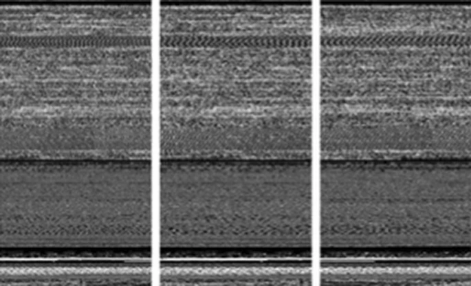
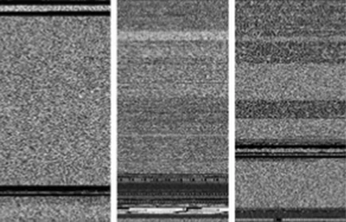

# Rex Coleman Strategic Machine Learning Cybersecurity Portfolio
A curated collection of innovative machine learning projects integrating lean business principles with cutting-edge AI cybersecurity solutions.

## Introduction
Welcome to my Strategic Cybersecurity Data Science Portfolio. As a data scientist dedicated to driving cybersecurity innovation and market leadership, I merge lean business principles with state-of-the-art AI solutions. This portfolio showcases my ability to blend advanced data science methodologies with robust cybersecurity practices, emphasizing strategic problem-solving and industry leadership. The projects in this portfolio showcase two themes: i) strategic cybersecuity and AI innovation and ii) data science best practices.  My portfolio takes a "stand on the shoulders of giants" approach by building upon appropriately cited leading works from Kaggle and from other sourcses.  This serves to accelerate my learning curve and to nurture a top 1% mindset.  Throughout this portfolio I have taken ample opportunity to showcase my personal contrubututions and innovation.  I hope you find reviewing this portfolio as enjoyable and thought provoking as it was for me to create it.

## Table of Contents
1. [About Me](#1-about-me)
   - [1.1 Programming Languages](#11-programming-languages)
   - [1.2 Tools and Technologies](#12-tools-and-technologies)
   - [1.3 Data Handling and Analysis](#13-data-handling-and-analysis)
   - [1.4 Mathematics for Machine Learning](#14-mathematics-for-machine-learning)
   - [1.5 Machine Learning and Deep Learning](#15-machine-learning-and-deep-learning)
   - [1.6 Models](#16-models)
   - [1.7 Methodologies and Best Practices](#17-methodologies-and-best-practices)
2. [Projects Overview](#2-projects-overview)
   - [2.1 Cybersecurity Data](#21-cybersecurity-data)
     - [2.1.1 Microsoft Malware Prediction](#211-microsoft-malware-prediction)
   - [2.2 Deep Learning](#22-deep-learning)
     - [2.2.1 Neutralizing Surveillance / Privacy Bias](#221-neutralizing-surveillance--privacy-bias)
     - [2.2.2 Enhancing Phishing Detection With Neural Style Transfer](#222-enhancing-phishing-detection-with-neural-style-transfer)
     - [2.2.3 U-Net in Cybersecurity: Precision Image Segmentation for Enhanced Security Measures](#223-u-net-in-cybersecurity-precision-image-segmentation-for-enhanced-security-measures)
     - [2.2.4 Unlocking Cybersecurity Potential with Sentiment Analysis](#224-unlocking-cybersecurity-potential-with-sentiment-analysis)
   - [2.3 Data Science Frameworks](#23-data-science-frameworks)
     - [2.3.1 Generalized Data Science Framework - Titanic](#231-generalized-data-science-framework---titanic)
     - [2.3.2 Machine Learning Framework - Pima Indians](#232-machine-learning-framework---pima-indians)
   - [2.4 Data Preparation](#24-data-preparation)
     - [2.4.1 Feature Engineering Deep Dive - Pima Indians](#241-feature-engineering-deep-dive---pima-indians)
     - [2.4.2 Outliers Deep Dive - Pima Indians](#242-outliers-deep-dive---pima-indians)
   - [2.5 Model Specific](#25-model-specific)
     - [2.5.1 TensorFlow Decision Forest - Titanic](#251-tensorflow-decision-forest---titanic)
     - [2.5.2 K Nearest Neighbors - Pima Indians](#252-k-nearest-neighbors---pima-indians)
3. [Achievements and Recognitions](#3-achievements-and-recognitions)
4. [Learning And Development](#4-learning-and-development)
5. [Contact Information](#5-contact-information)

## 1) About Me
I am a data scientist with a strong background in cybersecurity, dedicated to driving innovation and achieving market leadership. My career journey has been shaped by a passion for solving complex problems and a commitment to continuous learning. I am attending Georgia Tech's Master's of Science in Analytics program, hold a Masters in Business Administration from the Melbourne Business School in Australia, and a Bachelor of Science in Biochemistry and Molecular Biology from the University of California Santa Cruz.  I worked at FireEye / Mandiant for decade starting when FireEye was an 80 person company.  For half that time I held a variety of date related roles and for the other half I was a sales rep.  Most recently, I took a few bets as an entrepreneur exploring how to solve cybersecurity problems with blockchain technology.  Throughout this journey I have discovered that at my core, I am a geek, and that my greatest contributions will eminate from harnessing that power.  Through the projects in this portfolio, I am to communicate both my technical data science prowess and my strategic cybersecurity acumen.

### 1.1) Programming Languages
- **Python**
- **SQL**

### 1.2) Tools and Technologies
- **Machine Learning and Deep Learning Frameworks:** TensorFlow, Scikit-Learn
- **Data Manipulation and Analysis:** Pandas, NumPy
- **Visualization:** Matplotlib, Seaborn
- **Development and Environment:** Anaconda, Jupyter Notebooks
- **Version Control and Collaboration:** Git, GitHub
- **Others:** SciPy, itertools, Graphviz, os, sys, IPython, random, time, Dask, tqdm, pickle

### 1.3) Data Handling and Analysis
- **Processes:** Data Mining, Data preprocessing, feature engineering, exploratory data analysis

### 1.4) Mathematics for Machine Learning
- **Linear Algebra:** Eigenvalues And Eigenvectors, Basis, Transformation Matrix
- **Multivariate Calculus:** Principal Component Analysis (PCA), Dimensionality Reduction, Multivariable Calculus, Vector Calculus, Linear Regression, Gradient Descent, Backpropagation, Mathematical Optimization
- **Probability & Statistics:** Statistical Analysis, Probability, Statistical Hypothesis Testing
  
### 1.5) Machine Learning and Deep Learning
- **Techniques:** Regression, classification, clustering, neural networks, ensembling, stacking, Logistic Regression
- **Sequence Models:** Transformers, Attention Models, Gated Recurrent Unit (GRU), Recurrent Neural Network, Natural Language Processing, Long Short Term Memory (LSTM)
- **Convolutional Neural Networks:** Facial Recognition System, Object Detection and Segmentation
- **Unsupervised Learning:** Anomaly Detection, Reinforcement Learning, Collaborative Filtering, Recommender Systems
- **Structuring Machine Learning Projects:** Neural Network Architecture, Decision-Making, Inductive Transfer, Multi-Task Learning, Hyperparameter Tuning, Regularization to Avoid Overfitting

### 1.6) Models
- **Trees:** DecisionTreeClassifier, ExtraTreeClassifier
- **Ensemble Methods:** XGBClassifier, AdaBoost, Bagging, ExtraTrees, GradientBoosting, RandomForest
- **Gaussian Processes:** GaussianProcessClassifier
- **Generalized Linear Models (GLM):** LogisticRegressionCV, PassiveAggressiveClassifier, RidgeClassifierCV, SGDClassifier, Perceptron
- **Naive Bayes:** BernoulliNB, GaussianNB
- **Nearest Neighbors:** KNeighborsClassifier
- **Support Vector Machines (SVM):** SVC, NuSVC, LinearSVC
- **Discriminant Analysis:** LinearDiscriminantAnalysis, QuadraticDiscriminantAnalysis

### 1.7) Methodologies and Best Practices
- **Project Management:** Version control with Git, comprehensive documentation, organized code structure
- **Data Science Workflow:** Data collection, preprocessing, modeling, evaluation, and deployment
- **Quality Assurance:** Cross-validation, hyperparameter tuning, rigorous model evaluation

## 2) Projects Overview
### 2.1) Cybersecurity Data
#### [2.1.1) Microsoft Malware Prediction](https://github.com/rexcoleman/Microsoft-Malware-Prediction)

**Why This Project Matters:**

This project showcases my ability to tackle real-world cybersecurity challenges using advanced data science techniques. It demonstrates my proficiency in managing large-scale data, implementing sophisticated algorithms, and delivering actionable insights that can enhance security measures.

**Project Highlights:**
- **Cybersecurity Data:** This is my first of soon to be many data science projects leveraging cybersecurity data to solve cybersecurityu problems.
- **Complex Data:** The project utilizes a larg and complex dataset.
- **Production-Ready Design:** The project is cleanly organized and designed for a production environment.
- **Advanced Techniques:** Utilizes LightGBM, a state-of-the-art gradient boosting framework that enhances model performance and efficiency.

### 2.2) Deep Learning
#### [2.2.1) Neutralizing Surveillance / Privacy Bias](https://github.com/rexcoleman/Neutralizing-Surveillance-Privacy-Bias)
#### Executive Summary

Addressing bias in cybersecurity is essential to ensure effective threat detection, efficient resource allocation, and maintaining user trust. Bias in cybersecurity can originate from historical data, algorithmic design, or human judgment, leading to compromised security measures, inefficient use of resources, and damaged organizational reputation. Data scientists play a critical role in identifying and mitigating these biases through diverse and representative data collection, fairness-aware algorithms, and continuous model evaluation. This report outlines the importance of addressing bias in cybersecurity and provides a detailed summary of a project on operations with word vectors, highlighting its accomplishments and relevance to mitigating bias.

*Figure 1: Surveillance privacy bias vector - This image illustrates the surveillance privacy bias vector and how serveillance related terms in blue tend to be above the line and privacy related terms in orange tend to be below the line.*

### 5.2 Name Bias Neutralization

*Figure 2: Name bias neutralization - The before image on the left illustrates the impact of bias in surveillance systems, highlighting how certain demographics may be disproportionately targeted or overlooked, leading to privacy concerns and unfair treatment.  The after image on the right demonstrates how techniques to neutralize bias associated with names in datasets, can level the playing field.*

#### [2.2.2) Enhancing Phishing Detection With Neural Style Transfer](https://github.com/rexcoleman/Enhancing_Phishing-Detection-With-Neural-Style-Transfer)

#### Executive Summary

- **Neural Style Transfer:** An algorithm that generates artistic images by merging the content of one image with the style of another.
- **Pretrained ConvNet:** Uses hidden layer activations from a pretrained ConvNet to compute content and style cost functions.
- **Optimization:** Optimizes the total cost function to synthesize new images, updating pixel values instead of model parameters.
- **Cybersecurity Applications:** Enhances phishing detection, image authentication, forensic analysis, and advanced obfuscation techniques, showcasing its practical relevance in cybersecurity.

By integrating NST into cybersecurity data science, we can develop more robust and versatile models that improve the detection, analysis, and prevention of cyber threats.

*Figure 1: Detecting Phishing Websites with Neural Style Transfer - This image shows an exagerated visual representation of a legitimate website credit card form being altered by a hactivist meme and the resulting suspicious phishing website. The cybersecurity goal in this context is to identify phishing websites pretending to be legitimate websites but with subtly different style.*

*Figure 2: Surf Art Stenography - This image shows an exagerated visual representaqtion of a cybercriminal concealing sensitive infromation (Basquiat Painting) inside a surf image. The cybersecurity goal in this context would be to identify sensitive information such as malware or encryption keys that a threat actor subtly hid within the image to avoid detection.*

#### [2.2.3) U-Net in Cybersecurity: Precision Image Segmentation for Enhanced Security Measures](https://github.com/rexcoleman/U-Net-in-Cybersecurity-Precision-Image-Segmentation-for-Enhanced-Security-Measures)
#### Executive Summary

This report showcases the application of U-Net, a powerful convolutional neural network architecture, in cybersecurity through precision image segmentation. U-Net's ability to accurately segment images has significant implications for enhancing security measures such as intrusion detection, anomaly detection in network traffic, facial recognition for access control, and digital forensics. This document explores the architecture of U-Net, its applications in cybersecurity, a project demonstration in image segmentation, and future directions for leveraging U-Net in cybersecurity.

Releated Malware Families                             | Unreleated Malware Families
:---------------------------------------------------: | :---------------------------------------------------:
 | 

*Figure 2: U-net's ability to segment features in images could be applied to a wide array of cybersecurity use cases. As an exsample, this figure shows images of related malware families (left) and unrelated malware families (right).*

#### [2.2.4) Unlocking Cybersecurity Potential with Sentiment Analysis](https://github.com/rexcoleman/Unlocking-Cybersecurity-Potential-with-Sentiment-Analysis)
#### Executive Summary

Sentiment analysis is a pivotal tool in cybersecurity, leveraging natural language processing (NLP) techniques to enhance threat detection, incident response, and overall security strategies. This report explores the diverse applications of sentiment analysis in cybersecurity, focusing on practical implementations such as the Emojify project. By analyzing sentiments expressed in textual data from various sources, organizations can proactively manage risks, improve incident handling, and safeguard their reputation.

*Figure 1: This image showing how the GloVe algorithm was used to classify sentiment analysis by appling an Emoji at the end of a sentence.*
### 2.3) Data Science Frameworks
#### [2.3.1) Generalized Data Science Framework - Titanic](https://github.com/rexcoleman/GeneralizedDataScienceFramework-Titanic)
## Executive Summary

Welcome to my Framework for Solving Data Science Problems. This repository provides a comprehensive framework for solving data science problems. The project builds upon one of the most popular [Kaggle notebooks](https://www.kaggle.com/code/ldfreeman3/a-data-science-framework-to-achieve-99-accuracy), leveraging best-in-class methodologies to create a reliable foundation for solving data science problems. By reproducing and substantially building upon this work, I aim to illustrate the value of learning from top practitioners while also solving one of the most important problems in data science.

Rushing into a data science project without a structured approach can lead to numerous problems, which can severely impact project success, cost, and outcomes. This project addresses these issues by implementing a well-defined framework and best practices ensuring thorough problem understanding, effective data preprocessing, and robust model evaluation.

Borrowing fron the giants of Agile, DevOps, and Lean Entrepreneurship, we are leveragine the concept of ['shifting left'](https://en.wikipedia.org/wiki/Shift-left_testing) to support a more flexible and adaptive development process, facilitating faster delivery of high-quality data science solutions that originate from clearly defined business needs.

This project applies the above concepts to the popular "Titanic - Machine Learning from Disaster" Kaggle competition and can applied generally to a wide array of data science problems.

Thank you for visiting my repository. I hope this project inspires you to implement a structured approach to avoid common data science pitfalls.  I welcome comments: especially those that will help improve upon this concept.

*Figure 1: Model Accuracy - This plot shows train, validate and test model accuracies in Kaggle test accuracy order.  The top four models (BaggineClassifier, BernoulliNB, XGBClassifier and EnsembleHardVoting) outperformed both hard and soft voting ensemble models.  The Baseline Handmade Decision Tree model several other models.*

#### [2.3.2) Machine Learning Framework - Pima Indians](https://github.com/rexcoleman/Machine-Learning-Framework-Pima-Indians)
**Why This Project Matters:**

This project reinforces my understanding of fundamental data science concepts and techniques. It highlights my ability to apply these principles to different datasets, ensuring versatility and breadth in my analytical skills.

**Project Highlights:**
- **Simplified Framework:** Offers a slightly simpler yet complementary framework to the Titanic project, focusing on the Pima Indians dataset.
- **Model Stacking:** Includes both ensembling and stacking of multiple traditional learning models to boost performance.

### 2.4) Data Preparation
#### [2.4.1) Feature Engineering Deep Dive - Pima Indians](https://github.com/rexcoleman/Feature-Engineering-Deep-Dive-Pima-Indians-Pima-Indians)
**Why This Project Matters:**

Feature engineering is critical to improving model accuracy and performance. This project showcases my ability to manipulate and transform data to extract valuable features, enhancing the predictive power of models. In the realm of cybersecurity, effective feature engineering can significantly enhance threat detection, behavioral analysis, malware classification, and risk assessment. This demonstrates my capability to apply advanced feature engineering techniques to improve security measures, protect sensitive information, and ensure robust cybersecurity defenses.

**Project Highlights:**
- **In-Depth Analysis:** Provides a comprehensive exploration of feature engineering techniques and their impact on model performance. In cybersecurity, this involves transforming raw data into meaningful features that enhance threat detection and behavioral analysis.
- **Practical Applications:** Demonstrates the practical value of feature engineering in achieving superior results. Applications include improving malware classification, phishing detection, intrusion detection systems (IDS), and anomaly detection in cloud security.

#### [2.4.2) Outliers Deep Dive - Pima Indians](https://github.com/rexcoleman/Outliers-Deep-Dive---Pima-Indians/tree/main)
**Why This Project Matters:**

Understanding and handling outliers is essential for building reliable models. This project demonstrates my expertise in maintaining data quality and addressing anomalies that could skew results.

**Project Highlights:**
- **Outlier Analysis:** Focuses on the detection and remediation of outliers, highlighting their impact on modeling.
- **Methodological Approach:** Utilizes various techniques to identify and address outliers, ensuring data integrity and model robustness.

### 2.5) Model Specific
#### [2.5.1) TensorFlow Decision Forest - Titanic](https://github.com/rexcoleman/TensorFlow-Decision-Forest-Titanic/tree/main)
**Why This Project Matters:**

This project illustrates my capability to leverage cutting-edge technologies like TensorFlow to enhance model performance. It underscores my adaptability and continuous learning in utilizing different tools and frameworks to solve complex problems.

**Project Highlights:**
- **TensorFlow Expertise:** Applies TensorFlow, a leading deep learning library, to decision forest models, highlighting my versatility with different machine learning frameworks.
- **Innovative Techniques:** Demonstrates the application of decision forests within TensorFlow, integrating deep learning capabilities with traditional models.

#### [2.5.2) K Nearest Neighbors - Pima Indians](https://github.com/rexcoleman/K-Nearest-Neighbors-Pima-Indians)
**Why This Project Matters:**

This project adds depth to my portfolio by showcasing my proficiency with different algorithms. It demonstrates my ability to select and implement appropriate models based on the dataset and problem at hand.

**Project Highlights:**
- **Algorithm Focus:** Implements the K Nearest Neighbors algorithm, emphasizing its application and effectiveness on the Pima Indians dataset.
- **Model Evaluation:** Provides a thorough evaluation of the model's performance, highlighting strengths and limitations.

## 3) Achievements and Recognitions
- **Certifications:** [List relevant certifications]
- **Competitions and Hackathons:** [Mention notable achievements]
- **Publications and Contributions:** [Include any publications, blog posts, or contributions]

## 4) Learning and Development

I am committed to continuous growth in data science and cybersecurity through ongoing online courses in machine learning and data science. Additionally, I have been accepted into Georgia Tech’s Online Master of Science in Analytics (OMS Analytics) program, starting [August, 2024].

### Georgia Tech’s OMS Analytics Program Highlights:
- **Top-5 Ranking:** Nationally recognized for data science and analytics education.
- **Interdisciplinary Curriculum:** Integrates expertise from Georgia Tech’s College of Computing, College of Engineering, and Scheller College of Business.
- **Flexibility and Relevance:** 100% online format tailored for professionals, focusing on advanced skills in machine learning, statistical modeling, and business analytics.

This program will equip me with the knowledge and skills to contribute effectively to cybersecurity challenges, leveraging cutting-edge analytics to enhance threat detection and data security practices.

## 5) Contact Information
- **LinkedIn:** [https://www.linkedin.com/in/rexcoleman/](https://www.linkedin.com/in/rexcoleman/)
- **GitHub:** [Your GitHub Repository]
- **Personal Website:** [Your Personal Website]
- **Email:** [Your Email Address]

