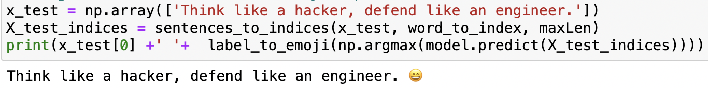
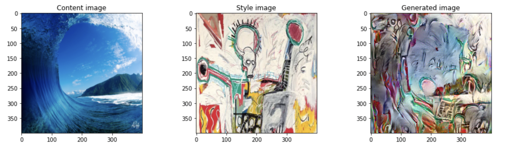
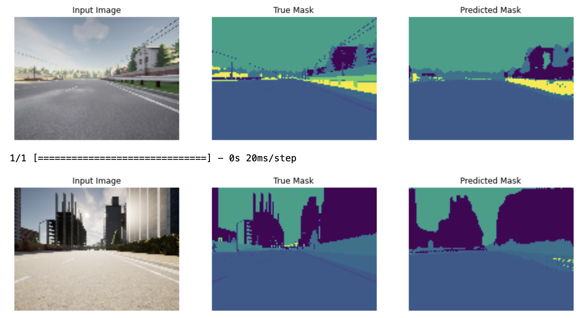
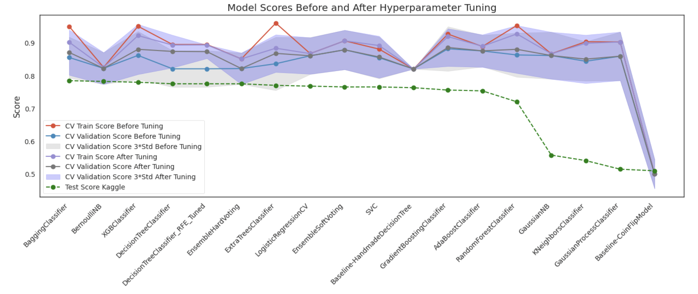
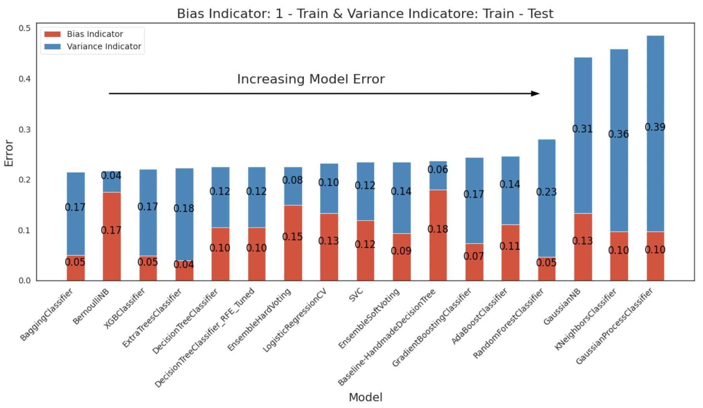
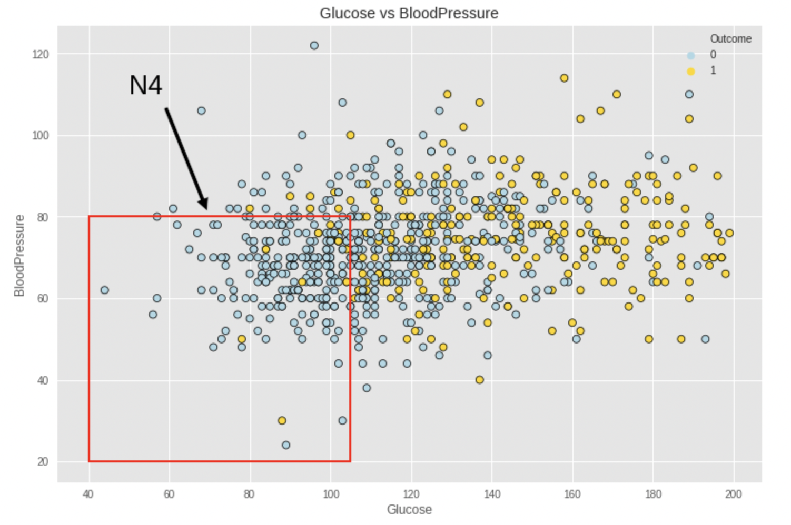

# Rex Coleman Machine Learning Cybersecurity Portfolio
A curated collection of machine learning projects demonstrating practical applications and advanced methodologies.

## Introduction
Welcome to my Machine Learning and Cybersecurity Portfolio. As a seasoned data scientist with extensive experience in cybersecurity, I aim to showcase my comprehensive skill set through a series of projects that blend advanced data science methodologies with robust cybersecurity principles. This portfolio highlights my strategy of intentionally building upon leading projects from Kaggle to accelerate my learning curve and develop a top 1% data science skill set. Each project is carefully selected and meticulously crafted to demonstrate my proficiency and dedication to the field.

## About Me
I am a data scientist with a strong background in cybersecurity. My career journey has been shaped by a passion for solving complex problems and a commitment to continuous learning. I am a candidate for a Masters of Science in Analytics from Georgia Tech, hold an MBA from Melbourne Business School in Australia, a Bachelor of Science in Biochemistry from the University of California Santa Cruz and have worked on various projects that demonstrate my skills in both data science and cybersecurity.

### Programming Languages
- **Python**
- **SQL**

### Tools and Technologies
- **Machine Learning and Deep Learning Frameworks:** TensorFlow, Scikit-Learn
- **Data Manipulation and Analysis:** Pandas, NumPy
- **Visualization:** Matplotlib, Seaborn
- **Development and Environment:** Anaconda, Jupyter Notebooks
- **Version Control and Collaboration:** Git, GitHub
- **Others:** SciPy, itertools, Graphviz, os, sys, IPython, random, time, Dask, tqdm, pickle

### Data Handling and Analysis
- **Processes:** Data preprocessing, feature engineering, exploratory data analysis

### Machine Learning and Deep Learning
- **Techniques:** Regression, classification, clustering, neural networks, convolutional neural networks, sequence models, ensembling, stacking

### Models
- **Trees:** DecisionTreeClassifier, ExtraTreeClassifier
- **Ensemble Methods:** XGBClassifier, AdaBoost, Bagging, ExtraTrees, GradientBoosting, RandomForest
- **Gaussian Processes:** GaussianProcessClassifier
- **Generalized Linear Models (GLM):** LogisticRegressionCV, PassiveAggressiveClassifier, RidgeClassifierCV, SGDClassifier, Perceptron
- **Naive Bayes:** BernoulliNB, GaussianNB
- **Nearest Neighbors:** KNeighborsClassifier
- **Support Vector Machines (SVM):** SVC, NuSVC, LinearSVC
- **Discriminant Analysis:** LinearDiscriminantAnalysis, QuadraticDiscriminantAnalysis

## Methodologies and Best Practices
- **Project Management:** Version control with Git, comprehensive documentation, organized code structure
- **Data Science Workflow:** Data collection, preprocessing, modeling, evaluation, and deployment
- **Quality Assurance:** Cross-validation, hyperparameter tuning, rigorous model evaluation

## Projects Overview
### 1. Microsoft Malware Prediction
**Project Highlights:**
- **Flagship Project:** This project represents the intersection of cybersecurity and data science, making it a cornerstone of my portfolio.
- **Production-Ready Design:** The project is cleanly organized and designed for a production environment, handling large and complex datasets effectively.
- **Advanced Techniques:** Utilizes LightGBM, a state-of-the-art gradient boosting framework that enhances model performance and efficiency.

**Why This Project Matters:**
This project showcases my ability to tackle real-world cybersecurity challenges using advanced data science techniques. It demonstrates my proficiency in managing large-scale data, implementing sophisticated algorithms, and delivering actionable insights that can enhance security measures.

### 2. Emojify!
**Project Highlights:**
- **NLP and Sentiment Analysis:** Utilizes word vector representations to build an Emojifier that makes text messages more expressive.
- **Word Embeddings:** Implements techniques to generalize and associate words with emojis, even if the words do not appear in the training set.
- **Sequence Models:** Leverages LSTMs to build a sentiment classifier using word embeddings.

**Why This Project Matters:**
This project demonstrates my ability to apply natural language processing (NLP) techniques and sequence models to real-world applications. It showcases my proficiency in using word embeddings to improve the accuracy of sentiment analysis and enhance user experiences.

### 3. Deep Learning & Art: Neural Style Transfer
**Project Highlights:**
- **Creative Application:** Combines the content of one image with the style of another to create unique artistic images.
- **Advanced Deep Learning:** Implements Neural Style Transfer using TensorFlow and VGG-19, showcasing the use of pre-trained models for transfer learning.
- **Optimization Techniques:** Focuses on optimizing cost functions to generate visually appealing images.

**Why This Project Matters:**
This project blends creativity with deep learning, demonstrating my ability to apply advanced neural network techniques to generate novel and artistic outputs. It highlights my proficiency in implementing complex algorithms and optimizing cost functions.

### 4. Image Segmentation with U-Net
**Project Highlights:**
- **Advanced Segmentation:** Implements U-Net, a sophisticated convolutional neural network designed for precise image segmentation.
- **Self-Driving Car Dataset:** Applies semantic image segmentation to images from a self-driving car dataset, labeling each pixel with its corresponding class.
- **Practical Application:** Demonstrates the importance of pixel-perfect understanding in autonomous driving for safety and navigation.

**Why This Project Matters:**
This project underscores the critical role of semantic image segmentation in advanced applications such as self-driving cars. It showcases my ability to implement complex deep learning models and highlights the practical importance of precise image understanding.

### 5. Generalized Data Science Framework - Titanic
**Project Highlights:**
- **Comprehensive Framework:** Provides a detailed approach to solving data science problems, serving as a foundational template for various projects.
- **Model Ensemble:** Includes multiple traditional machine learning models, demonstrating the power of ensemble techniques in improving predictive accuracy.

**Why This Project Matters:**
This project outlines a robust framework for approaching data science tasks, emphasizing the importance of a systematic and methodical approach. It showcases my ability to design and implement a diverse set of models to achieve optimal results.

## Results and Insights

The project results include detailed analysis, model performance metrics, and visualizations that provide insights into the predictive power of the models used.

Our top four models (test accuracy) are BaggineClassifier, BernoulliNB, XGBClassifier and EnsembleHardVoting.

Defining avoidable bias as 1.0 - train accuracy. 1.0 is arguably an unrealistic figure for human level error. We can justify it given that over 250 submissions reported perfect accuracy scores.

Defining variance as the spread between test error and train error. Typically it is better to use the difference in dev error (validation error) and training error. In the case of our models, there is a wide margin between validation error and test error so we are including it in our variance error calculation.

As a general rule for model performance, we want to work on improving the greater error (bias or variance).

### 6. TensorFlow Decision Forest - Titanic
**Project Highlights:**
- **TensorFlow Expertise:** Applies TensorFlow, a leading deep learning library, to decision forest models, highlighting my versatility with different machine learning frameworks.
- **Innovative Techniques:** Demonstrates the application of decision forests within TensorFlow, integrating deep learning capabilities with traditional models.

**Why This Project Matters:**
This project illustrates my capability to leverage cutting-edge technologies like TensorFlow to enhance model performance. It underscores my adaptability and continuous learning in utilizing different tools and frameworks to solve complex problems.

### 7. Machine Learning Framework - Pima Indians
**Project Highlights:**
- **Simplified Framework:** Offers a slightly simpler yet complementary framework to the Titanic project, focusing on the Pima Indians dataset.
- **Model Stacking:** Includes both ensembling and stacking of multiple traditional learning models to boost performance.

**Why This Project Matters:**
This project reinforces my understanding of fundamental data science concepts and techniques. It highlights my ability to apply these principles to different datasets, ensuring versatility and breadth in my analytical skills.

### 8. Feature Engineering Deep Dive - Pima Indians
**Project Highlights:**
- **In-Depth Analysis:** Provides a comprehensive exploration of feature engineering techniques and their impact on model performance.
- **Practical Applications:** Demonstrates the practical value of feature engineering in achieving superior results.

**Why This Project Matters:**
Feature engineering is critical to improving model accuracy and performance. This project showcases my ability to manipulate and transform data to extract valuable features, enhancing the predictive power of models.

### 9. Outliers Deep Dive - Pima Indians
**Project Highlights:**
- **Outlier Analysis:** Focuses on the detection and remediation of outliers, highlighting their impact on modeling.
- **Methodological Approach:** Utilizes various techniques to identify and address outliers, ensuring data integrity and model robustness.

**Why This Project Matters:**
Understanding and handling outliers is essential for building reliable models. This project demonstrates my expertise in maintaining data quality and addressing anomalies that could skew results.

### 10. K Nearest Neighbors - Pima Indians
**Project Highlights:**
- **Algorithm Focus:** Implements the K Nearest Neighbors algorithm, emphasizing its application and effectiveness on the Pima Indians dataset.
- **Model Evaluation:** Provides a thorough evaluation of the model's performance, highlighting strengths and limitations.

**Why This Project Matters:**
This project adds depth to my portfolio by showcasing my proficiency with different algorithms. It demonstrates my ability to select and implement appropriate models based on the dataset and problem at hand.

## Achievements and Recognitions
- **Certifications:** [List relevant certifications]
- **Competitions and Hackathons:** [Mention notable achievements]
- **Publications and Contributions:** [Include any publications, blog posts, or contributions]

## Future Goals
- **Career Aspirations:** Outline my career goals and aspirations in data science and cybersecurity.
- **Learning and Development:** Mention areas I am currently focusing on for further skill development.

## Contact Information
- **LinkedIn:** [Your LinkedIn Profile]
- **GitHub:** [Your GitHub Repository]
- **Personal Website:** [Your Personal Website]
- **Email:** [Your Email Address]

---
